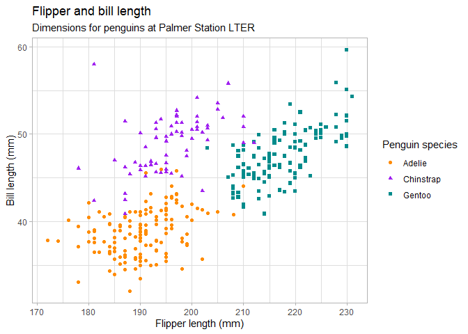

Hello, Quarto
================
Julian Oliver Dörr

## Quarto

[Quarto](https://quarto.org/) weaves together narrative text and code to
produce elegantly formatted output. Most interestingly, Quarto executes
code written in different languages. The following gives an illustration
of cross-language coding in Quarto (here using **`R`** and
**`Python`** - other languages are supported as well).

## Cross-language coding

### R

**`R`** code chunks are written and executed just as we would do it in R
Markdown. So, for users of R Markdown this should be very familiar.

``` r
data(penguins, package = "palmerpenguins")
penguins <- penguins[complete.cases(penguins),]

ggplot(penguins, 
       aes(x = flipper_length_mm, y = bill_length_mm)) +
  geom_point(aes(color = species, shape = species)) +
  scale_color_manual(values = c("darkorange","purple","cyan4")) +
  labs(
    title = "Flipper and bill length",
    subtitle = "Dimensions for penguins at Palmer Station LTER",
    x = "Flipper length (mm)", y = "Bill length (mm)",
    color = "Penguin species", shape = "Penguin species"
  ) +
  theme_light()
```



### Python

The beauty comes into play when we add **`Python`** chunks of code.

``` python
penguins = r.penguins
penguins.head(3)
```

      species     island  bill_length_mm  bill_depth_mm  flipper_length_mm  \
    0  Adelie  Torgersen            39.1           18.7                181   
    1  Adelie  Torgersen            39.5           17.4                186   
    2  Adelie  Torgersen            40.3           18.0                195   

       body_mass_g     sex  year  
    0         3750    male  2007  
    1         3800  female  2007  
    2         3250  female  2007  

We simply switched from **`R`** to **`Python`** working on the
*penguins* data set.

Now, let us train a simple classifier using the `scikit-learn` module in
**`Python`**.

``` python
y = penguins['species']
X = penguins[['bill_length_mm',  'bill_depth_mm',  'flipper_length_mm', 'body_mass_g']]
X_train, X_test, y_train, y_test = train_test_split(X, y, test_size = 0.2, random_state = 333)

classifier = RandomForestClassifier().fit(X_train, y_train)
y_test_pred = classifier.predict(X_test)

print(classification_report(y_test, y_test_pred))
```

                 precision    recall  f1-score   support

         Adelie       1.00      1.00      1.00        22
      Chinstrap       1.00      1.00      1.00        15
         Gentoo       1.00      1.00      1.00        30

    avg / total       1.00      1.00      1.00        67

## Conclusion

Great, with Quarto it is possible to write reports, presentations, …
using different languages. Here, we have made use of **`R`**’s
`tidyverse` for data preprocessing and visualization and **`Python`**’s
Machine Learning frameworks (`scikit-learn` in this example). So Quarto
really enables you to pick the best of both worlds.
